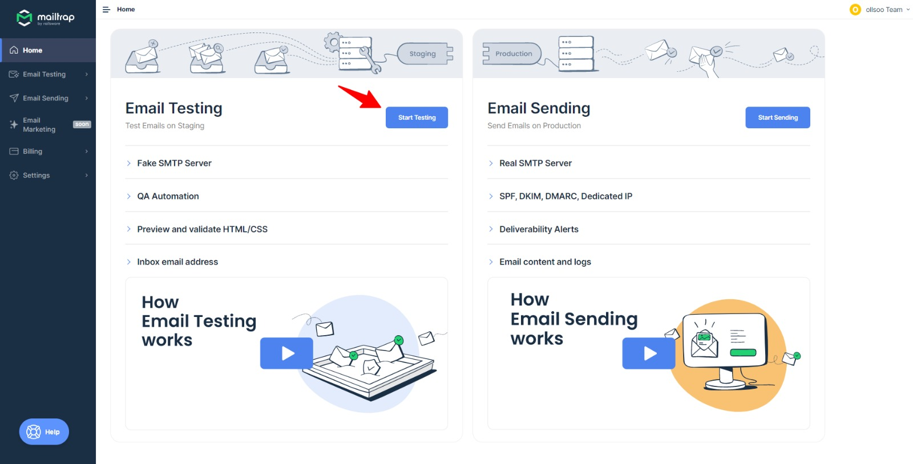

# Documentation Technique

Nous avons utilisé Laravel pour créer un MINI-CRM qui relie une entreprise à ses employés, Et installé Laravel UI Bootstrap pour concevoir un design simple et propre.

prérequis : PHP >= 8.1 | node >= 16.14.0 

## Sommaire

- Configuration du projet .
- Configuration de la base de données .
- Configuration SMTP (utilisation de [Mailtrap](https://mailtrap.io/) - dev environment) .
- Testing .
- Notes .


## Configuration du projet

- Clone GitHub repo
`` git clone linktogithubrepo.com/ projectName `` , cd Into It.
```console
# git clone linktogithubrepo.com/ miniCRM
# cd miniCRM
```
- Install Composer Dependencies
```console
# composer install
```
- Install NPM Dependencies
```console
# npm install
```


## Configuration de la base de données.
- run mysql
- .env file

Créez une nouvelle base de données``crm_db``(choisi un nom quelconque ) dans phpmyadmin et entrez les détails de la base de données dans le fichier .env comme indiqué ci-dessous.
```code 
DB_CONNECTION=mysql
DB_HOST=127.0.0.1
DB_PORT=3306
DB_DATABASE=crm_db
DB_USERNAME=root
DB_PASSWORD=
```

- Migrate the database.
```console
# php artisan migrate
```

- Seed the database.
```console
# php artisan db:seed
```

- Generate an app encryption key.

```console
# php artisan key:generate
```

## Configuration SMTP (utilisation de Mailtrap - dev environment) 
- Accéder à [mailtrap](https://mailtrap.io/) et inscrivez-vous.

- Vous pouvez choisir le plan gratuit pour tester la partie mail dans l'application.



- Choisi laravel 7+ (Fleche **1** dans la capture ci-dessous)

- Mettre le code donné (Fleche **2** dans la capture ci-dessous) dans le fichier .env


Remplace le code genere par le code qui existe déja dans le fichie .env (Voila un example de code genere)
```code 
MAIL_MAILER=smtp
MAIL_HOST=sandbox.smtp.mailtrap.io
MAIL_PORT=2525
MAIL_USERNAME=67d3604dd2cd5d
MAIL_PASSWORD=d7f83ce409d2a7
MAIL_ENCRYPTION=tls
```


## Testing
#### Pour finaliser tout cela, exécutez les commandes suivantes sur votre terminal :

```console
# npm run dev
```

```console
# php artisan server
```

#### Voila quelque démonstartion
- Gestion d'entreprise


- Gestion d'employes / inviter un employe a l'entreprise qu'on a creer dans la demo precedent


- Espace employe


- La rechreche


Vous pouvez tester toutes les fonctionnalités declare dans le cahier de charge

## Notes

- Le Model User represente l'employé et l'admin, on diferencie entre les deux par le column is_admin (boolean)

- on a créez un middleware (IsAdmin) pour vérifier les utilisateurs qui peut accéder à l'Espace administrateur  ou qui peut accéder à l'Espace employé.

- Concernant le Module Historique et pour suivre les action suivants : Envoi d'invitationtions // Annulation d’invitation // Validation d’invitation // Confirmation du profil d’un employé .
j'ai creer un service (ActionLogService) qui contien la methode CreateActionLog( ) qui nous permet d'enregister la tracabilite des actions , et pour minimiser le code de controleur.

 ```php
CreateActionLog(string $action_type, Invitation $invitation = NULL, User $user = NULL) {

}
```

Envoi d'invitation
```php
        // Send the invitation email with a link to the registration page
        $registrationLink = url('/verify/invitation?token=' . $token);
        Mail::to($invitation->email)->send(new InvitationMail($registrationLink));

        // Create a new Action Log record for the invitation sent
        $this->actionLogService->CreateActionLog("invitation_sent", $invitation); // 👈
```

Annulation d’invitation

```php
        $invitation = Invitation::find($id);
        //change the status of the invitation , status should be equal 2 : annulée
        
        $invitation->status = 2;  // 0 = en attente | 1 = validée | 2 = annulée || Default value equal 0
        $invitation->save();

        // Create a new Action Log record for the invitation cancel
        $this->actionLogService->CreateActionLog("invitation_cancel", $invitation);  // 👈
```

Validation d’invitation

```php

        // Get token from the URL
        $token = $request->query('token');

        // Find the invitation with the matching token and the status != 2 (annulée)
        $invitation = Invitation::where('token', $token)->where('status', '<>', 2)->first();

        // If the token is not valid, show the error message
        if (!$invitation) {
            abort(404, 'Token invalide');
        }

        //change the status of the invitation , status should be equal 1 : validée
        $invitation->status = 1;
        $invitation->save();
        // Create a new Action Log record for the invitation valid
        $this->actionLogService->CreateActionLog("invitation_valid", $invitation); // 👈

```

Confirmation du profil d’un employé

```php
        // inputs validation
         ...
        //create the Employee (compléter son profil )
        $user = User::create([
            'name' => $request->name,
            'email' => $request->email,
            'password' => Hash::make($request->password),
            'address' => $request->address,
            'phone' => $request->phone,
            'birth_date' => $request->birth_date,
            'is_admin' => false,
            'company_id' => $request->company_id,
        ]);
        // Create a new Action Log record for the register confirmation
        $this->actionLogService->CreateActionLog("user_confirmed", null, $user); // 👈

```